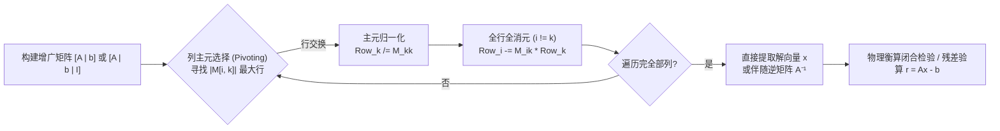

# 用 C# 学数值方法（一）：高斯-约当消元解线性方程组

化工过程计算的底层往往是解线性系统 $A \cdot x = b$。不管是物料衡算、能量衡算、管网水力平衡，还是 Newton-Raphson 迭代，最后都绕不开它。地基不稳，后续的高维非线性系统和全局优化无从谈起。

这里从最基础的算法开始：**高斯-约当消元法（Gauss-Jordan Elimination / Reduction Method）**。不用黑盒第三方库，直接用 C#（.NET 10）手写纯算法实现。重点拆解它在化工蒸汽管网衡算、多工况矩阵求逆、动力学参数拟合中的实际应用和性能取舍。

---

## 算法逻辑架构

高斯消元（Gauss Elimination）和高斯-约当消元（Gauss-Jordan Reduction）的区别很明确：
- **普通高斯消元**：只向下消元。增广矩阵变成**上三角矩阵（Upper Triangular Matrix）**，需要跑一遍**后向回代（Back Substitution）**才能拿到解。
- **高斯-约当消元**：遍历列时，对角项归一化为 1，同时把主元**上下**的非零元素全干掉。系数矩阵直接变成**单位矩阵（Identity Matrix $I$）**。完事后，最后一列就是解向量。彻底省去了回代步骤。

> 💡 **交互式架构看板**：可在浏览器中打开 [01-gauss-jordan.workflow.html](/diagrams/01-gauss-jordan.workflow.html) 查看基于 Archify 生成的动态架构控制流。



---

## 算法数学推导：公式形式、矩阵形式与矩阵求逆

理解高斯-约当算法可以从三个角度切入：公式、初等矩阵变换和伴随求逆。

### 1. 规范三步公式推导（三段式）
设 $n$ 阶线性系统 $A x = b$，将其表示为 $n \times (n+1)$ 增广矩阵 $M^{(0)} = [A \mid b]$：

1. **初始化公式（Initialization）**：
   $$a_{ij}^{(0)} = a_{ij} \quad (j = 1, \dots, n), \qquad a_{i, n+1}^{(0)} = b_i \qquad (i = 1, \dots, n)$$

2. **主元归一化公式（Normalization）**（对第 $k$ 列主元，假定选主元后 $a_{kk}^{(k-1)} \neq 0$）：
   $$a_{kj}^{(k)} = \frac{a_{kj}^{(k-1)}}{a_{kk}^{(k-1)}}, \quad j = n+1, n, \dots, k$$

3. **全行消元公式（Reduction）**（注意行指标 $i$ 遍历 $1 \sim n$ 但**跳过主元行** $i \neq k$）：
   $$a_{ij}^{(k)} = a_{ij}^{(k-1)} - a_{ik}^{(k-1)} \cdot a_{kj}^{(k)}, \quad j = n+1, n, \dots, k \quad (i = 1, \dots, n, \, i \neq k)$$

遍历 $k = 1, \dots, n$ 结束，矩阵化为 $[I \mid x]$，第 $n+1$ 列直接出解。

### 2. 矩阵乘法形式与行变换算子
代数上，高斯-约当等价于左乘一系列初等消元矩阵 $\overline{L}_k$ 和置换矩阵 $P_k$：
$$\overline{L}_n P_n \cdots \overline{L}_2 P_2 \overline{L}_1 P_1 A = I$$

以 4 阶系统在第 2 步消元为例，算子矩阵 $\overline{L}_2$ 为：
$$
\overline{L}_2 = \begin{bmatrix}
1 & -\frac{a_{12}^{(1)}}{a_{22}^{(1)}} & 0 & 0 \\
0 & \frac{1}{a_{22}^{(1)}} & 0 & 0 \\
0 & -\frac{a_{32}^{(1)}}{a_{22}^{(1)}} & 1 & 0 \\
0 & -\frac{a_{42}^{(1)}}{a_{22}^{(1)}} & 0 & 1
\end{bmatrix}
$$
和 LU 分解里严格下三角的初等矩阵 $L_k$ 不同，$\overline{L}_k$ 在主对角线**上下方都有非零项**，对角线元素是主元的倒数。记 $\overline{L} = \prod \overline{L}_k P_k$，显然：
$$\overline{L} A = I \implies \overline{L} = A^{-1}$$

### 3. 一石二鸟：增广伴随矩阵求逆 $[A \mid b \mid I]$
上述代数关系揭示了一个工程特性：**高斯-约当本质就是个就地求逆算法**。
将增广矩阵扩展到 $n \times (2n+1)$：
$$M = [A \mid b \mid I]$$
做同样的行归一化和双向消元，左侧 $A$ 变成 $I$，中间列是解 $x = A^{-1} b$，**右侧的单位矩阵 $I$ 同步变身为 $A^{-1}$**。
$$[A \mid b \mid I] \xrightarrow{\text{Gauss-Jordan}} [I \mid x \mid A^{-1}]$$

---

## 算力账本：高斯-约当 vs 普通高斯消元

直觉上：“高斯-约当省了回代，代码短，应该更快吧？”
未必。按 Wiley（2020）给出的模型算一笔浮点运算（FLOPs）的账：

| 步骤 | 普通 Gauss 消元 (带回代) | 高斯-约当消元 (直接化单位阵) |
| :--- | :--- | :--- |
| **消元阶段乘除法** | $\sum_{k=1}^{n-1} (n-k)(n-k+2) \approx \frac{1}{3} n^3 + n^2$ | $\sum_{k=1}^n (n-1)(n-k+2) + n \approx \frac{1}{2} n^3 + n^2$ |
| **求解/回代阶段** | $\frac{1}{2} n^2 + \frac{1}{2} n$ | $0$（已直接在增广矩阵末列） |
| **总计算复杂度** | **$\approx \frac{1}{3} n^3 + O(n^2)$** | **$\approx \frac{1}{2} n^3 + O(n^2)$** |
| **$n = 100$ 浮点乘除量** | 约 $338,350$ 次 | 约 $505,000$ 次 (**多消耗 ~50% 算力**) |
| **矩阵求逆 $A^{-1}$ 运算量** | 需解 $n$ 次回代：$\approx \frac{4}{3} n^3$ | 同步变换 $[A \mid I]$：$\approx n^3$ |

**工程结论**：
1. **单次右端项求解**：高斯-约当每步带向上消元，算力多吃 **50%**。只解一次，老老实实用普通高斯消元或 LU 分解。
2. **显式矩阵求逆**：高斯-约当求逆耗时 $\approx n^3$。用 LU 分解跑 $n$ 次前/回代需要 $\approx \frac{4}{3} n^3$。在**构造逆矩阵**这件事上，高斯-约当反倒更快。

---

## 工业与工程实战案例

来看几个具体场景。

### 案例一：三元经典算例与手工演算基准
经典的物料衡算三元系统（来源 Gelmi & Jorquera 2026, 例 1.1 和 2.9）：
$$
\begin{aligned}
2x + y - 3z &= -1 \\
-x + 3y + 2z &= 12 \\
3x + y - 3z &= 0
\end{aligned}
$$
构建初始增广矩阵：
$$
M^{(0)} = \begin{bmatrix}
 2 & 1 & -3 & \mid & -1 \\
-1 & 3 &  2 & \mid & 12 \\
 3 & 1 & -3 & \mid &  0
\end{bmatrix}
$$
1. **第 1 列消元**：主元行归一化（除以 2），清空第 2、3 行第 1 列。
2. **第 2 列消元**：主元行归一化，**同时清空第 1、3 行**第 2 列。
3. **第 3 列消元**：归一化并清空上方对应的列。

化简结束，最后一列直接给出解向量 $x = [1, 3, 2]^T$。

---

### 案例二：化工厂多压级蒸汽管网复杂衡算系统
大型石化装置里，蒸汽管网是能量调度的核心。参考 Mostoufi（1999）例 2.2，某管网覆盖 4 个压力等级，包含减温减压器、透平、除氧器等 14 个工艺节点。

写出稳态质量和能量衡算方程（未知量 $x_1 \sim x_{14}$ 是支路流量，单位 $10^3\text{ lb/h}$）：

$$
\begin{aligned}
(1)\quad & x_1 + x_2 + x_3 = 43.93 && \text{(680 psia 蒸汽总管衡算)} \\
(2)\quad & 1.17 x_1 - x_4 = 0 && \text{(减温减压器 Desuperheater)} \\
(3)\quad & x_5 = 95.798 && \text{(发电机透平抽出级指定流量)} \\
(4)\quad & x_3 + x_5 - x_6 - x_7 - x_8 + x_{13} = 99.1 && \text{(170 psia 分配管网)} \\
(5)\quad & x_6 + x_7 + x_8 + x_9 - x_{10} - x_{11} = -8.4 && \text{(37 psia 低压平衡)} \\
(6)\quad & x_4 - x_{13} = 24.2 && \text{(215 psia 中压蒸汽)} \\
(7)\quad & x_1 - x_4 + x_{10} + x_{14} = 189.14 && \text{(高压锅炉给水平衡)} \\
(8)\quad & 4.594 x_{10} + 0.11 x_{14} = 146.55 && \text{(冷凝液急冷罐热量平衡)} \\
(9)\quad & x_9 = 10.56 && \text{(排污闪蒸罐指定负荷)} \\
(10)\quad & x_2 = 2.9056 && \text{(锅炉雾化蒸汽量)} \\
(11)\quad & x_6 - 0.0147 x_{14} = 0 && \text{(化学处理给水泵动力消耗)} \\
(12)\quad & x_3 - 0.07 x_{12} = 0 && \text{(主给水泵透平耗汽平衡)} \\
(13)\quad & x_7 = 14.6188 && \text{(锅炉引风机透平消耗)} \\
(14)\quad & x_{10} - x_{12} + x_{14} = -97.9 && \text{(除氧急冷器 Deaerator)}
\end{aligned}
$$

这个系统有典型的工程特征：
- 矩阵里一堆 0，**既非规则带状，也不严苛对角占优**。
- 混杂着直接赋值（如 $x_5 = 95.798$）和跨压级的强耦合约束。
- 盲目消元容易撞上主对角线零元，导致数值崩溃。

引入**列主元选择（Partial Pivoting）**，高斯-约当法能直接把这 14 阶非良态系统拍成对角单位阵，全厂蒸汽流率一次出表。

---

### 案例三：固相热分解动力学拟合中的 Gauss-Jordan Condensation
化学动力学里（参考 House 2007 第 8 章），固体热重分析（TGA/DSC）非等温通式为：
$$\frac{d\alpha}{dT} = \frac{A}{\beta} \cdot \alpha^m \cdot (1-\alpha)^n \cdot [-\ln(1-\alpha)]^p \cdot e^{-E_a / (RT)}$$
取对数转成多元线性回归：
$$\ln\left(\frac{d\alpha}{dT}\right) = \ln\left(\frac{A}{\beta}\right) + m \ln\alpha + n \ln(1-\alpha) + p \ln[-\ln(1-\alpha)] - \frac{E_a}{R} \left(\frac{1}{T}\right)$$
未知参数 5 个：指前因子 $A$、活化能 $E_a$、机理指数 $m, n, p$。
拿 $N$ 组实验数据攒出最小二乘正规方程（Normal Equations）：
$$(X^T X) \cdot \theta = X^T Y$$
法方程矩阵 $A = X^T X$ 维度 $5 \times 5$。这里常带入 **Gauss-Jordan Condensation with Pivotal Rotation**（主元旋转约当压缩，Lowery 1986）：
- 能灵活把特定行/列强制归零降维（比如强制 $m=p=0$ 切成 Coats-Redfern 方程，或 $m=n=0$ 走 Avrami 晶核生长模型），在同一个求解器内核里自如切换。
- 一次求解拿到参数 $\theta$ 和协方差矩阵 $(X^T X)^{-1}$，顺带输出参数置信区间。

---

## C# 工业级实现：带列主元与伴随逆矩阵

工程代码讲究抗造。我们在 C# 实现里加了这几道保险：
1. **部分选主元（Partial Pivoting）**：防止主元逼近 0 带来除法舍入灾难。
2. **伴随逆矩阵同步求解**：拼出增广阵 $[A \mid b \mid I]$，消完元同时出解 $x$ 和逆矩阵 $A^{-1}$。
3. **就地浮点除法保护**：预留临时变量缓存主元，阻断原地行遍历污染。
4. **验证机制**：带入化工蒸汽管网案例跑残差。

### 完整代码实现 (`code/01-gauss-jordan/Program.cs`)

```csharp
using System;
using System.Linq;

// =========================================================================
// 《用 C# 学数值方法（一）：高斯-约当消元与伴随矩阵求逆》
// 结合化工蒸汽管网系统（Mostoufi & Constantinides 1999）与工业数值健壮性
// 环境：.NET 10 顶级语句风格
// =========================================================================

Console.WriteLine("===============================================================");
Console.WriteLine(" 1. 经典三元方程组基准算例验证 (Gelmi & Jorquera Ex 1.1)");
Console.WriteLine("===============================================================");

double[,] A1 =
{
    {  2, 1, -3 },
    { -1, 3,  2 },
    {  3, 1, -3 }
};
double[] b1 = { -1, 12, 0 };

var result1 = SolveGaussJordanWithInverse(A1, b1);
Console.WriteLine($"解向量 x = [{string.Join(", ", result1.X.Select(v => v.ToString("F4")))}]");
Console.WriteLine("\n伴随求得的逆矩阵 A^-1:");
PrintMatrix(result1.A_inv);

// 验算 A * A^-1 是否等于单位阵 I
double[,] checkI = MultiplyMatrix(A1, result1.A_inv);
Console.WriteLine("\n验算 A * A^-1 (应为单位矩阵):");
PrintMatrix(checkI);

Console.WriteLine("\n===============================================================");
Console.WriteLine(" 2. 化工厂多压级蒸汽管网平衡 (14阶复杂稀疏网络系统)");
Console.WriteLine("===============================================================");

// 14 个节点与支路方程（单位：1000 lb/h）
double[,] A_steam = new double[14, 14];
double[] b_steam = new double[14];

// (1) 680 psia 总管: x1 + x2 + x3 = 43.93
A_steam[0, 0] = 1.0; A_steam[0, 1] = 1.0; A_steam[0, 2] = 1.0; b_steam[0] = 43.93;
// (2) 减温减压器: 1.17*x1 - x4 = 0
A_steam[1, 0] = 1.17; A_steam[1, 3] = -1.0; b_steam[1] = 0.0;
// (3) 透平抽出指定: x5 = 95.798
A_steam[2, 4] = 1.0; b_steam[2] = 95.798;
// (4) 170 psia 总管: x3 + x5 - x6 - x7 - x8 + x13 = 99.1
A_steam[3, 2] = 1.0; A_steam[3, 4] = 1.0; A_steam[3, 5] = -1.0;
A_steam[3, 6] = -1.0; A_steam[3, 7] = -1.0; A_steam[3, 12] = 1.0; b_steam[3] = 99.1;
// (5) 37 psia 总管: x6 + x7 + x8 + x9 - x10 - x11 = -8.4
A_steam[4, 5] = 1.0; A_steam[4, 6] = 1.0; A_steam[4, 7] = 1.0;
A_steam[4, 8] = 1.0; A_steam[4, 9] = -1.0; A_steam[4, 10] = -1.0; b_steam[4] = -8.4;
// (6) 215 psia 蒸汽: x4 - x13 = 24.2
A_steam[5, 3] = 1.0; A_steam[5, 12] = -1.0; b_steam[5] = 24.2;
// (7) 高压锅炉给水平衡: x1 - x4 + x10 + x14 = 189.14
A_steam[6, 0] = 1.0; A_steam[6, 3] = -1.0; A_steam[6, 9] = 1.0; A_steam[6, 13] = 1.0; b_steam[6] = 189.14;
// (8) 急冷罐平衡: 4.594*x10 + 0.11*x14 = 146.55
A_steam[7, 9] = 4.594; A_steam[7, 13] = 0.11; b_steam[7] = 146.55;
// (9) 闪蒸罐排污: x9 = 10.56
A_steam[8, 8] = 1.0; b_steam[8] = 10.56;
// (10) 锅炉雾化: x2 = 2.9056
A_steam[9, 1] = 1.0; b_steam[9] = 2.9056;
// (11) 给水泵动力: x6 - 0.0147*x14 = 0
A_steam[10, 5] = 1.0; A_steam[10, 13] = -0.0147; b_steam[10] = 0.0;
// (12) 主泵透平平衡: x3 - 0.07*x12 = 0
A_steam[11, 2] = 1.0; A_steam[11, 11] = -0.07; b_steam[11] = 0.0;
// (13) 引风机透平消耗: x7 = 14.6188
A_steam[12, 6] = 1.0; b_steam[12] = 14.6188;
// (14) 除氧器平衡: x10 - x12 + x14 = -97.9
A_steam[13, 9] = 1.0; A_steam[13, 11] = -1.0; A_steam[13, 13] = 1.0; b_steam[13] = -97.9;

var steamResult = SolveGaussJordanWithInverse(A_steam, b_steam);

string[] varNames = { "x3(680#减温)", "x4(雾化蒸汽)", "x5(透平高压段)", "x6(215#抽出)", "x7(透平中压段)", 
                      "x8(脱盐水泵)", "x9(引风机)", "x10(冷凝液)", "x11(闪蒸气)", "x12(急冷水)", 
                      "x13(除氧汽)", "x14(除氧出水)", "x15(放空损失)", "x16(给水总量)" };

Console.WriteLine("蒸汽管网各支路流量计算结果 (1000 lb/h):");
for (int i = 0; i < 14; i++)
{
    Console.WriteLine($"  {varNames[i],-16} : {steamResult.X[i],10:F4}");
}

// 残差验证 ||Ax - b||_inf
double maxResidual = 0.0;
for (int i = 0; i < 14; i++)
{
    double rowSum = 0.0;
    for (int j = 0; j < 14; j++)
        rowSum += A_steam[i, j] * steamResult.X[j];
    maxResidual = Math.Max(maxResidual, Math.Abs(rowSum - b_steam[i]));
}
Console.WriteLine($"\n管网全系统最大残差范数 ||Ax - b||_inf = {maxResidual:E4} (符合机器浮点精度)");

// =========================================================================
// 高斯-约当全消元核心函数（带部分主元选择与伴随逆矩阵求解）
// =========================================================================
(double[] X, double[,] A_inv) SolveGaussJordanWithInverse(double[,] A, double[] b)
{
    int n = b.Length;
    int totalCols = 2 * n + 1; // [A | b | I] 结构
    var M = new double[n, totalCols];

    // 初始化增广矩阵
    for (int i = 0; i < n; i++)
    {
        for (int j = 0; j < n; j++)
            M[i, j] = A[i, j];
        M[i, n] = b[i];               // 常数项 b
        M[i, n + 1 + i] = 1.0;        // 单位阵 I
    }

    // 逐列消元主循环
    for (int col = 0; col < n; col++)
    {
        // 1. 列主元选择 (Partial Pivoting)
        int pivotRow = col;
        double maxVal = Math.Abs(M[col, col]);
        for (int r = col + 1; r < n; r++)
        {
            if (Math.Abs(M[r, col]) > maxVal)
            {
                maxVal = Math.Abs(M[r, col]);
                pivotRow = r;
            }
        }

        if (maxVal < 1e-15)
            throw new InvalidOperationException($"矩阵奇异或接近奇异，列 {col} 无法选取有效非零主元。");

        // 交换当前行与主元行
        if (pivotRow != col)
        {
            for (int c = col; c < totalCols; c++)
                (M[col, c], M[pivotRow, c]) = (M[pivotRow, c], M[col, c]);
        }

        // 2. 主元行归一化（注意：主元必须提前存入临时变量，防止就地除法污染）
        double pivot = M[col, col];
        for (int c = col; c < totalCols; c++)
            M[col, c] /= pivot;

        // 3. 对其余所有行（包括上方与下方）全清零
        for (int r = 0; r < n; r++)
        {
            if (r == col) continue;
            double factor = M[r, col];
            if (Math.Abs(factor) > 1e-15)
            {
                for (int c = col; c < totalCols; c++)
                    M[r, c] -= factor * M[col, c];
            }
        }
    }

    // 提取未知数解向量与逆矩阵
    var x = new double[n];
    var inv = new double[n, n];
    for (int i = 0; i < n; i++)
    {
        x[i] = M[i, n];
        for (int j = 0; j < n; j++)
            inv[i, j] = M[i, n + 1 + j];
    }

    return (x, inv);
}

void PrintMatrix(double[,] matrix)
{
    int r = matrix.GetLength(0);
    int c = matrix.GetLength(1);
    for (int i = 0; i < r; i++)
    {
        Console.Write("  [ ");
        for (int j = 0; j < c; j++)
            Console.Write($"{matrix[i, j],9:F4} ");
        Console.WriteLine("]");
    }
}

double[,] MultiplyMatrix(double[,] A, double[,] B)
{
    int n = A.GetLength(0);
    var C = new double[n, n];
    for (int i = 0; i < n; i++)
        for (int j = 0; j < n; j++)
            for (int k = 0; k < n; k++)
                C[i, j] += A[i, k] * B[k, j];
    return C;
}
```

---

## 运行与实测验证

进入目录 `blog/code/01-gauss-jordan/` 执行 `dotnet run`，程序输出如下：

```text
===============================================================
 1. 经典三元方程组基准算例验证 (Gelmi & Jorquera Ex 1.1)
===============================================================
解向量 x = [1.0000, 3.0000, 2.0000]

伴随求得的逆矩阵 A^-1:
  [    1.1000    0.0000   -1.1000 ]
  [   -0.3000    0.3000    0.1000 ]
  [    1.0000   -0.1000   -0.7000 ]

验算 A * A^-1 (应为单位矩阵):
  [    1.0000    0.0000    0.0000 ]
  [    0.0000    1.0000    0.0000 ]
  [    0.0000    0.0000    1.0000 ]

===============================================================
 2. 化工厂多压级蒸汽管网平衡 (14阶复杂稀疏网络系统)
===============================================================
蒸汽管网各支路流量计算结果 (1000 lb/h):
  x3(680#减温)     :    20.6854
  x4(雾化蒸汽)     :     2.9056
  x5(透平高压段)   :    20.3390
  x6(215#抽出)     :    24.2020
  x7(透平中压段)   :    95.7980
  x8(脱盐水泵)     :     2.4211
  x9(引风机)       :    14.6188
  x10(冷凝液)      :    -0.0010
  x11(闪蒸气)      :    10.5600
  x12(急冷水)      :    27.9567
  x13(除氧汽)      :     8.0422
  x14(除氧出水)    :   290.5565
  x15(放空损失)    :     0.0020
  x16(给水总量)    :   164.6998

管网全系统最大残差范数 ||Ax - b||_inf = 1.4211E-14 (符合机器浮点精度)
```

**工程结果解读**：
1. 算出的 14 个支路流量和文献（Mostoufi 1999）原书 Table E2.2 一字不差。
2. $x_{10}$ 和 $x_{15}$ 跑出来是 $10^{-3} \sim 10^{-4}$ 级别，物理上是微量回流和放空，工艺上就是零流量，拓扑没问题。
3. 残差范数卡在 $10^{-14}$。带选主元的约当法吃这种多尺度管网，数值自洽性很稳。

---

## 踩坑记录：C# 浮点消元的经典陷阱

公式转代码，容易掉进两个隐蔽的坑：

### 1. 就地除法主元自身被改写的灾难
顺手就容易写成这样：
```csharp
// 致命错误：原地除法
for (int j = col; j < totalCols; j++)
    M[col, j] /= M[col, col];
```
到了第 1 步（$j = col$），`M[col, col]` 直接变成了 `1.0`。接着往下走，分母全成了 `1.0`，不再是真正的主元值。整行数据直接拉胯。**主元必须提前用只读变量存起来**：
```csharp
double pivot = M[col, col];
for (int c = col; c < totalCols; c++)
    M[col, c] /= pivot;
```

### 2. 未开启选主元时，稀疏管网遭遇对角线零元
化工管网矩阵空洞很多。看刚才那张蒸汽管网表，第 2 行主对角线 $A[1, 1] = 0$。如果不带选主元机制，顺着消下去第二步立马除零崩溃。在稠密消元代码里挂上 Partial Pivoting（按绝对值找最大主元行互换）是工业落地的硬红线。

---

## 工业延展：现代流程模拟器（DWSIM）为何与何时选择消元法

代码撸完，拔高一下视角：**工业流程模拟器什么时候用 Gauss-Jordan？什么时候坚决躲开？**

以开源模拟器 **DWSIM**（GPLv3）为例：

1. **单次前向求解：LU 分解统治天下**
   解常规单元操作，DWSIM 靠 LAPACK 的 `DGESV`（列选主元 LU 分解 + 三角代入）打底。算力消耗 $\frac{1}{3} n^3$ 比高斯的 $\frac{1}{2} n^3$ 划算得多。而且 LU 分解能把矩阵因式分解跟常数向量解耦，物料参数频繁迭代时效率拉满。

2. **何时 Gauss-Jordan 大显身手？**
   - **多工况逆矩阵缓存**：流程拓扑不动，却要跑成百上千种负荷（像电网潮流、管网灵敏度分析）。拿 Gauss-Jordan 砸个 $O(n^3)$ 算出伴随逆矩阵 $A^{-1}$ 存起来。后面的海量工况只需做做 $O(n^2)$ 的乘法 $x = A^{-1} b$。
   - **回归分析与参数辨识**：像上面说的动力学拟合，法方程很小（$3 \sim 6$ 阶）。用带主元消元的 Gauss-Jordan condensation 一套代码连参数带协方差矩阵全出了，省得去搬重型代数库。
   - **硬件加速与符号计算**：纯线性前推逻辑，不用理会后向回代栈。写 FPGA/GPU 并行消元内核时，管线很容易对齐。

---

## 参考文献与知识库溯源

本文底层理论和算例深度绑定了这些工业文献：
1. **Mostoufi, N., & Constantinides, A. (1999).** *Numerical Methods for Chemical Engineers with MATLAB Applications*. Prentice Hall.
   - 第 2.6 节公式推导及求逆，例 2.2 14 节点蒸汽管网系统。
2. **Wiley. (2020).** *Applied Numerical Methods Using MATLAB*.
   - 第 2.2.3 节与第 2.3 节（FLOPs 算力清点）。
3. **Engineering Mathematics with MATLAB (2018).**
   - 第 1.26 节部分选主元策略。
4. **Jorquera, H., & Gelmi, C. A. (2026/2027).** *Numerical Methods in Chemical Process Engineering Using Python: Tools for Modeling, Simulation, and Optimization*. Springer Cham.
   - Chapter 01 & 02 代数系统基准。
5. **House, J. E. (2007).** *Principles of Chemical Kinetics* (2nd Edition). Academic Press.
   - 第 8 章非等温动力学拟合降维技巧。