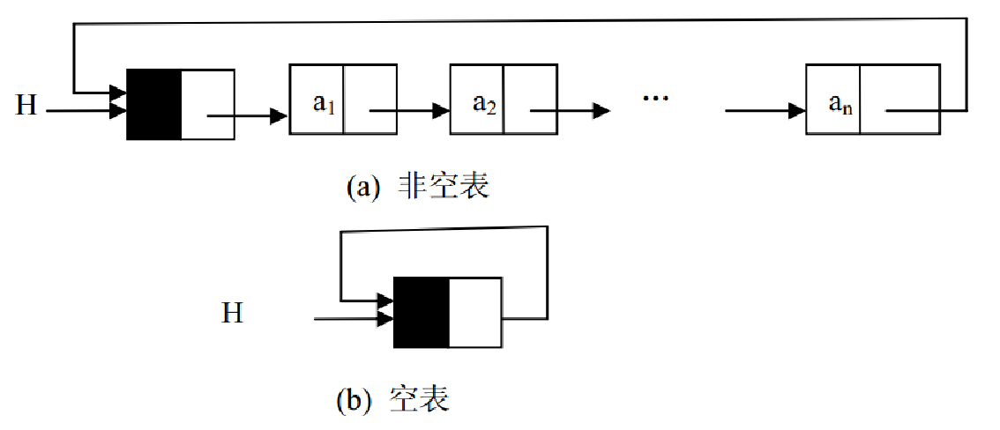

# 数据结构与算法 2.线性表


# 线性表

是最简单、最基本、最常用的数据结构。线性表是线性结构的抽象(Abstract)，线性结构的特点是结构中的数据元素之间存在一对一的线性关系。这种一对一的关系指的是数据元素之间的位置关系，即：（ 1）除第一个位置的数据元素外，其它数据元素位置的前面都只有一个数据元素；（ 2）除最后一个位置的数据元素外，其它数据元素位置的后面都只有一个元素。也就是说，数据元素是一个接一个的排列。因此，可以把线性表想象为一种数据元素序列的数据结构。线性表就是位置有先后关系，一个接着一个排列的数据结构。
线性表的实现方式有下面几种	**顺序表**	**单链表**	 **双向链表**   **循环链表**
在计算机内，保存线性表最简单、最自然的方式，就是把表中的元素一个接一个地放进顺序的存储单元，这就是线性表的顺序存储(Sequence Storage)。
C#语言中的数组在内存中占用的存储空间就是一组连续的存储区域，因此，数组具有任意存取的特点。所以，数组天生具有表示顺序表的数据存储区域的特性。线性表的另外一种存储结构——链式存储(Linked Storage)，这样的线性表叫链表(Linked List)。链表不要求逻辑上相邻的数据元素在物理存储位置上也相邻，因此，在对链表进行插入和删除时不需要移动数据元素，但同时也失去了顺序表可随机存储的优点。在存储数据元素时，除了存储数据元素本身的信息外，还要存储与它相邻的数据元素的存储地址信息。这两部分信息组成该数据元素的存储映像(Image)，称为结点(Node)。把存储据元素本身信息的域叫结点的数据域(Data Domain)，把存储与它相邻的数据元素的存储地址信息的域叫结点的引用域(Reference Domain)。因此，线性表通过每个结点的引用域形成了一根“链条”，这就是“链表”名称的由来。如果结点的引用域只存储该结点直接后继结点的存储地址，则该链表叫单链表(Singly Linked List)。把该引用域叫 next。有些应用不需要链表中有明显的头尾结点。在这种情况下，可能需要方便地从最后一个结点访问到第一个结点。此时，最后一个结点的引用域不是空引用，而是保存的第一个结点的地址（如果该链表带结点，则保存的是头结点的地址），也就是头引用的值。带头结点的循环链表(Circular Linked List)如图所示。



顺序表是用数组存储数据的

## 顺序表添加和得到功能

先写一个接口

```c#
using System;
using System.Collections.Generic;
using System.Linq;
using System.Text;
using System.Threading.Tasks;

namespace _001_线性表 {
    interface IListDS<T>
{
int GetLength();
void Clear();
bool IsEmpty();
void Add(T item);
void Insert(T item, int index);
T Delete(int index);
T this[int index] { get; }
T GetEle(int index);
int Locate(T value);
}
}
```

写顺序表：

```csharp
using System;
using System.Collections.Generic;
using System.Linq;
using System.Text;
using System.Threading.Tasks;

namespace _001_线性表 {
    /// <summary>
    /// 顺序表实现方式
    /// </summary>
    /// <typeparam name="T"></typeparam>
    class SeqList<T>:IListDS<T>
    {
        private T[] data;//用来存储数据
        private int count = 0;//表示存了多少个数据

        public SeqList(int size)//size就是最大容量
        {
            data = new T[size];
            count = 0;
        }

        public SeqList():this(10)//默认构造函数 容量是10
        {

        }
        /// <summary>
        /// 取得数据的个数
        /// </summary>
        /// <returns></returns>
        public int GetLength()
        {
            return count;
        }

        public void Clear()
        {
            count = 0;
        }

        public bool IsEmpty()
        {
            return count == 0;
        }

        public void Add(T item)
        {
            if (count == data.Length) //当前数组已经存满
            {
                Console.WriteLine("当前顺序表已经存满，不允许再存入");
            }
            else
            {
                data[count] = item;
                count++;
            }
        }

        public void Insert(T item, int index)
        {
            for (int i = count-1; i >=index; i--)
            {
                data[i + 1] = data[i];
            }
            data[index] = item;
            count++;
        }

        public T Delete(int index)
        {
            T temp = data[index];
            for (int i = index+1; i < count; i++)
            {
                data[i - 1] = data[i];// 把数据向前移动
            }
            count--;
            return temp;
        }

        public T this[int index] //通过索引器|通过方法
        {
            get { return GetEle(index); }
        }

        public T GetEle(int index)
        {
            if (index >= 0 && index <= count - 1) //索引存在
            {
                return data[index];
            }
            else
            {
                Console.WriteLine("索引不存在");
                return default(T);
            }
        }

        public int Locate(T value)
        {
            for (int i = 0; i < count; i++)
            {
                if (data[i].Equals(value))
                {
                    return i;
                }
            }
            return -1;
        }
    }
}
```

这样写的顺序表只能用for循环，foreach需要用另外的接口去实现

实现的代码简单不做笔记

## 实现单链表的节点类

```csharp
using System;
using System.Collections.Generic;
using System.Linq;
using System.Text;
using System.Threading.Tasks;

namespace _001_线性表 {
    /// <summary>
    /// 单链表的结点
    /// </summary>
    /// <typeparam name="T"></typeparam>
    class Node<T>
    {
        private T data;//存储数据
        private Node<T> next;//指针 用来指向下一个元素

        public Node()
        {
            data = default(T);//获得对应属性的默认值
            next = null;
        }

        public Node(T value)
        {
            data = value;
            next = null;
        }

        public Node(T value, Node<T> next)
        {
            this.data = value;
            this.next = next;
        }

        public Node(Node<T> next)
        {
            this.next = next;
        }

        public T Data
        {
            get { return data; }
            set { data = value; }
        }

        public Node<T> Next
        {
            get { return next; }
            set { next = value; }
        }
    }
}
```

利用节点实现单链表

## 实现单链表的添加和插入操作

利用节点实现单链表

添加一个节点来储存头结点

构造函数 head置空


```csharp
using System;
using System.Collections.Generic;
using System.Linq;
using System.Runtime.InteropServices;
using System.Text;
using System.Threading.Tasks;

namespace _001_线性表 {
    class LinkList<T>:IListDS<T>
    {
        private Node<T> head;//存储一个头结点

        public LinkList()
        {
            head = null;
        }


        public int GetLength()
        {
            if (head == null) return 0;
            Node<T> temp = head;
            int count = 1;
            while (true)
            {
                if (temp.Next != null)
                {
                    count++;
                    temp = temp.Next;
                }
                else
                {
                    break;
                }
            }
            return count;
        }

        public void Clear()
        {
            head = null;
        }

        public bool IsEmpty()
        {
            return head == null;
        }

        public void Add(T item)
        {
            Node<T> newNode = new Node<T>(item);//根据新的数据创建一个新的节点
            //如果头结点为空，那么这个新的节点就是头节点
            if (head == null)
            {
                head = newNode;
            }
            else
            {//把新来的结点放到 链表的尾部
                //要访问到链表的尾结点
                Node<T> temp = head;
                while (true)
                {
                    if (temp.Next != null)
                    {
                        temp = temp.Next;
                    }
                    else
                    {
                        break;
                    }
                }
                temp.Next = newNode;//把新来的结点放到 链表的尾部
            }
        }

        public void Insert(T item, int index)
        {
            Node<T> newNode = new Node<T>(item);
            if (index == 0) //插入到头节点
            {
                newNode.Next = head;
                head = newNode;
            }
            else
            {
                Node<T> temp = head;
                for (int i = 1; i <=index-1; i++)
                {
                    //让temp向后移动一个位置
                    temp = temp.Next;
                }
                Node<T> preNode = temp;
                Node<T> currentNode = temp.Next;
                preNode.Next = newNode;
                newNode.Next = currentNode;
            }
        }

        public T Delete(int index)
        {
            T data = default(T);
            if (index == 0) //删除头结点
            {
                data = head.Data;
                head = head.Next;
            }
            else
            {
                Node<T> temp = head;
                for (int i = 1; i <= index - 1; i++) {
                    //让temp向后移动一个位置
                    temp = temp.Next;
                }
                Node<T> preNode = temp;
                Node<T> currentNode = temp.Next;
                data = currentNode.Data;
                Node<T> nextNode = temp.Next.Next;
                preNode.Next = nextNode;
            }
            return data;
        }

        public T this[int index]
        {
            get
            {
                Node<T> temp = head;
                for (int i = 1; i <= index; i++) {
                    //让temp向后移动一个位置
                    temp = temp.Next;
                }
                return temp.Data;
            }
        }

        public T GetEle(int index)
        {
            return this[index];
        }

        public int Locate(T value)
        {
            Node<T> temp = head;
            if (temp == null)
            {
                return -1;
            }
            else
            {
                int index = 0;
                while (true)
                {
                    if (temp.Data.Equals(value))
                    {
                        return index;
                    }
                    else
                    {
                        if (temp.Next != null)
                        {
                            temp = temp.Next;
                        }
                        else
                        {
                            break;
                        }
                    }
                }
                return -1;
            }
        }
    }
}
```

## 双向链表

