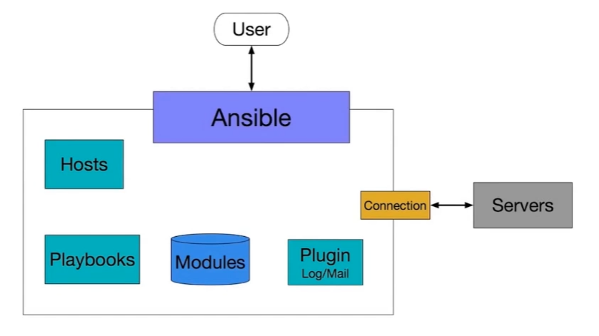
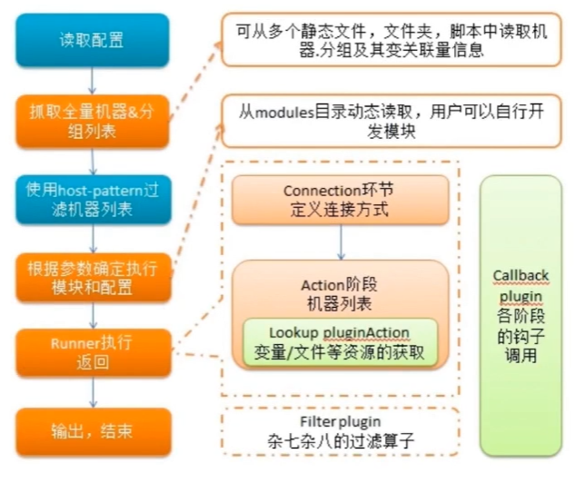
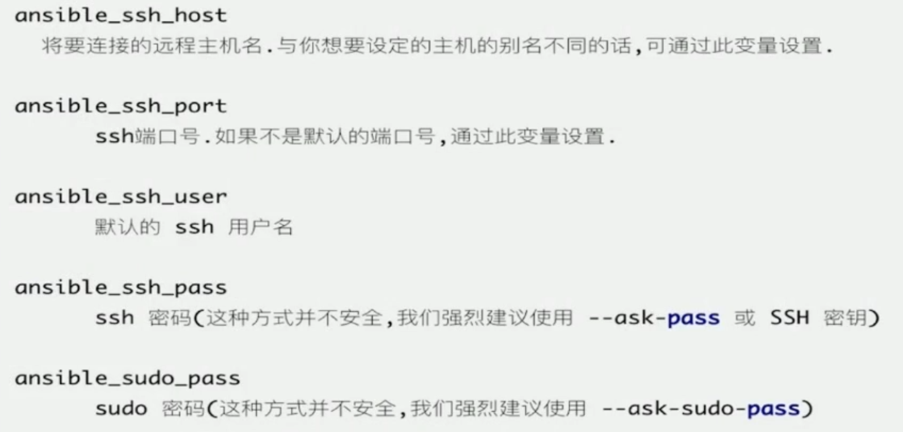
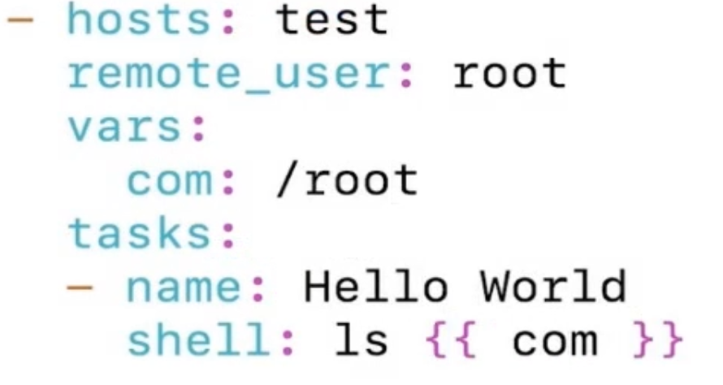
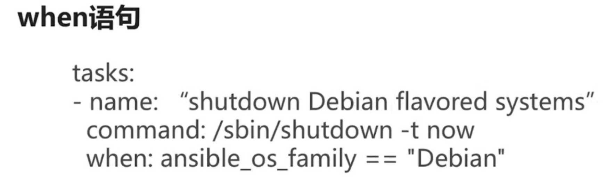
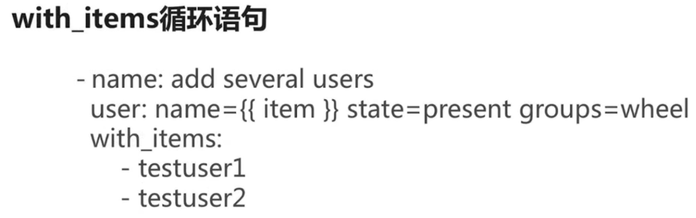
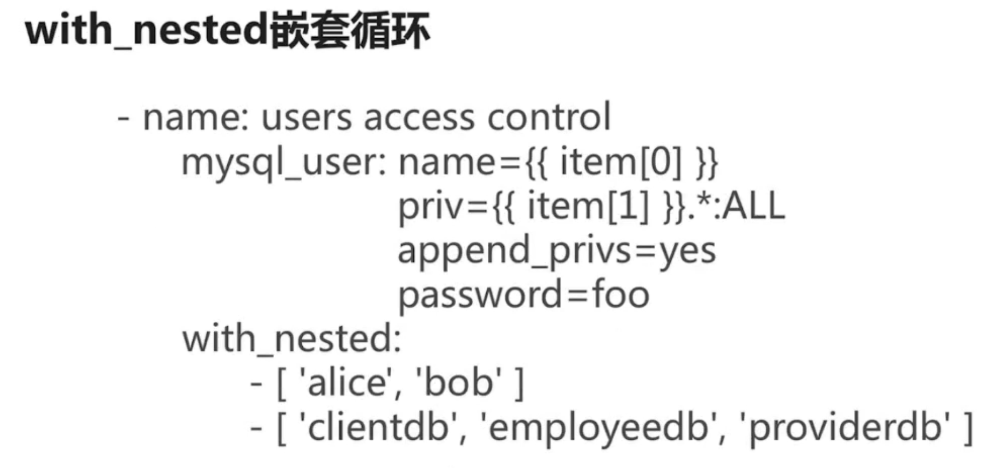
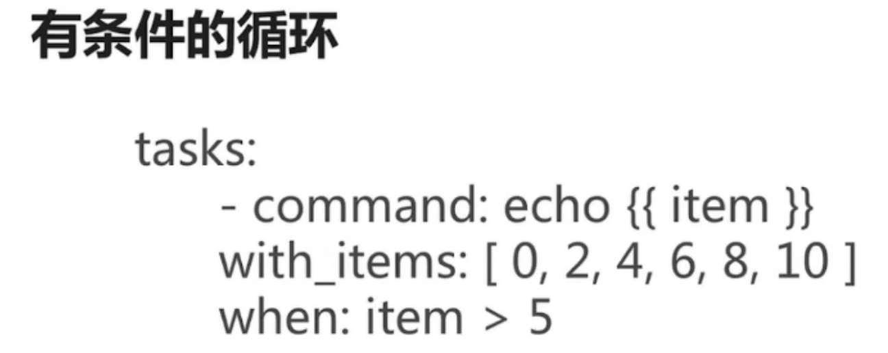
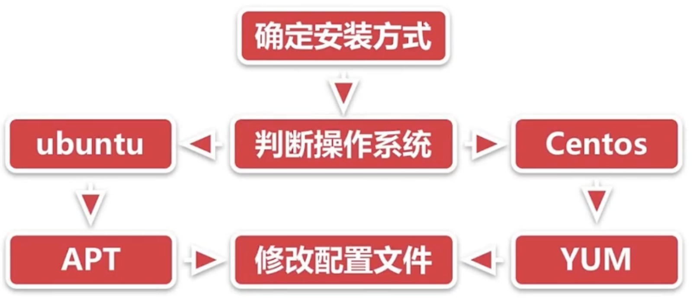

# 自动化运维架构笔记 Ansible


# Ansible

## 什么是Ansible

- IT自动化工具
- 依赖于现有的操作系统凭证来发个控制远程服务器
- 简单易用 安全可靠

Ansible可以完成哪些任务

- 配置系统
- 开发软件
- 编排高级的IT任务

特点

- 轻量级（命令行）
- 易学习（中文文档）
- 操作灵活

执行流程





 安装配置

pip装（编译依赖的开发库可能出错）

sudo pip install ansible

软件源(可能有跨平台的问题)：

- 配置Host连接主机：/etc/ansible/hosts(vim进入  ：wq退出)
  - [test]
  - 192.168.1.1
- 配置SSH
  - 添加公钥到远程主机：ssh-copy-id -i  ~/.ssh/id_rsa.pub root@192.168.1.1
  - 测试 ssh root@192.168.1.1
- 连通测试
  - 运行命令：ansible 192.168.1.39 all -m ping --user=root

## Ansible Ad-hoc

​	命令行工具	适用于业务快速变更（区别playbook）

​	所见即所得

​	Ansible help message

- 普通可选参数
- 链接目标主机相关参数
- 权限控制相关参数

```
列出目标主机目录
ansible test -m shell -a "ls /root" --user=root
目标主机登陆需要密码
ssh root@192.168.1.1
vim .ssh/authorized_keys
(#注释掉)
ssh登陆失败
ansible test -m shell -a "ls /root" --user=root --ask-pass
```

Ansible help

- -f并发
- -m 指定模块使用
- -i 改变默认行为
- 连接参数


## Ansible Inventory

### 定义主机关系的文件

默认路径：/etc/ansible/hosts

文件内容格式位ini

### Inventory主机组：

- 192.168.1.1
- 【组名】
- 192.168.1.2
- 192.168.1.3

### Inventory主机别名

test ansible_ssh_port=22 ansible_ssh_host=192.168.1.1 annsible_ssh_user=root

也可以分组

### Inventory链接参数



### Inventory批量主机组

【webservers】

www[01:50].example.com

[databases]

db-[a:f].example.com

## Ansible基本使用实战

了解Ansible使用

了解Ansible模块查找使用方法

**实战需求：**

- 安装MySQL到测试机
- 管理测试机的MySQL服务

**需要：**

- 一条测试机器：client
- 配置好ansible环境：master

```
ansible test -m yum -a "name=mariadb-server state=latest"
ansible test -m systemd -a "name=mariadb state=stopped"
ansible test -m shell -a "ps -ef|grep mysql|grep -v grep"
```

## 什么是Ansible Playbook

- 是一门编程语言
- 命令集合
- yaml格式

#### 功能列表：

- 声明配置
- 编排复杂任务
- 控制任务执行

#### 与Adhoc关系

- Playbook是对Adhoc的编排
- Adhoc适合简单快速的任务
- Playbook适合做一些复杂的任务

#### 支持的特性

- 变量定义
- 顺序 Or 选择 Or 循环结构

### Ansible Playbook使用入门

选定Host

指定登陆用户

使用Shell模块输出Hello World

```
hosts：test
remote_user: root
tasks:
- name: Hello World
	shell: ls /root

ansible-playbook test.yml
```

#### Playbook变量

- 以字母、数字、下划线组成
- 始终应该以字母开头

#### 变量位置

- Inventory
- Playbook(开头如果是大括号，就用双引号)




#### 系统变量

#### when语句



#### bool值


#### with-items循环语句



#### with_nested嵌套语句



#### 有条件的循环



## Ansible-Zabbix安装

- 需求分析
  - zabbix server安装
  - Master和Client，Centos和Ubuntu各一个（保证最小集群）
  - Zabbix进程正常启动
- 流程分析
  - 确认安装方式
  - 

### Shell版本

- ```
  rpm -ivh http://repo.zabbix.com/zabbix/3.4/rhel/7/x86_64/zabix-release-3.4-2.el7.noarch.rpm

  yum -y install zabbix-server-mysql
  yum -y install zabbix-proxy-mysql
  yum -y install zabbix-web-mysql
  yum -y install mariadb-server
  systemctl start mariadb
  mysql -uroot -e "create database zabbix"
  sed 's/DBUser=zabbix/DBUser=root/g' -i /etc/zabbix/zabbix_server.conf
  zcat /usr/share/doc/zabbix-server-mysql-3.4.7/create.sql.gz | mysql -uroot zabbix
  setenforce 0
  systemctl start zabbix-server
  ```


- 结果验证

scp centos7_install_zabbix.sh root@192.168.1.39:~

ssh root@192.168.1.39 "bash centos7_install_zabbix.sh"

Shell脚本要写很多判断看是否与运行正常 	编写复杂 操作繁琐 跨平台问题

### Playbook版本

```
vim /etc/ansible/hosts

centos ansible_ssh_port=22 ansible_ssh_host=192，168.1.39 ansible_ssh_user=root

ubuntu ansible_ssh_port=22 ansible_ssh_host=13.94.42.159 ansible_ssh_user=simon

[test]#分组

centos

ubuntu

vim test.yml

hosts：test

become：true #使用root权限

tasks：

​    name: install zabbix rpm

​	yum:

​		name:http://repo.zabbix.com/zabbix/3.4/rhel/7/x86_64/zabbix-re lease-3.4-2.el7.noarch.rpm

​		state: installed

​		when: ansible_distribution == 'Centos'

​    name: download zabbix deb

​    get_url:

​        url:http://repo.zabbix.com/zabbix/3.4/ubuntu/pool/main/z/zabbi x-release/zabbix-release_3.4-1+xenial_all.deb

​        dest:/tmp/zabbix.deb

​        when: ansible_distribution == 'Ubuntu'

​    name: install zabbix deb

​    apt:

​        name:/tmp/zabbix.deb

​        state: installed

​	    when: ansible_distribution == 'Ubuntu'

​    name: install zabbix deb

​	apt:

​		deb:/tmp/zabbix.deb #从本地装

​		when: ansible_distribution == 'Ubuntu'

​	name: install zabbix server

​	yum:

​		name:"{{ item }}"

​		state: installed

​	with_items:

​		-zabbix-server-mysql

​		-zabbix-proxy-mysql

​		-zabbix-web-mysql

​		when: ansible_distribution == 'Centos'

​	name: install zabbix agent

​	apt:

​		name: zabbix-agent

​		state: installed

​		when: ansible_distribution == 'Ubuntu'

​    name: config zabbix server

​		replace:

​			path:/etc/zabbix/zabbix_server.conf

​			regexp: DBUser=zabbix

​			replace: DBUser=root

​		when: ansible_distribution == 'Centos'

​	name: import db format

​	shell: zcat /usr/share/doc/zabbix-server-mysql-3.4.7/create.sql.g | mysql -uroot zabbix

​		when: ansible_distribution == 'Centos'

​	name:disable selinux

​	selinux:

​		state: disabled

​		when: ansible_distribution == 'Centos'

​	name: start zabbix server

​	systemd:

​		name:zabbix-server

​		state: started

​		when: ansible_distribution == 'Centos'

​	name: start zabbix agent

​	systemd:

​		name:zabbix-agent

​		state: started

​		when: ansible_distribution == 'Ubuntu'

ansible-playbook test.yml
```


