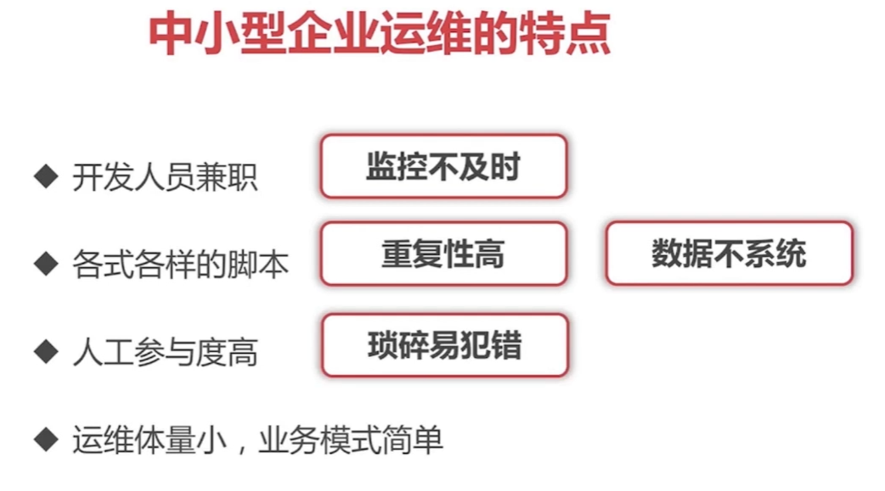

# 自动化运维架构笔记 架构

# 自动化运维架构笔记

## 中小型企业运维的特点

## 自动化运维的好处

- 及时的监控报警
- 持续可迭代的项目集成
- 运维数据的处理、统计和分析
- 批量服务管理

**架构图**

第一层**Ansible是一个自动化管理工具**完成批量服务器的管理操作
第二层是被管理的虚拟机，也就是说我们公司里面常用的一些it资源；
第三层是从左侧开始第一个是jump server（跳板机工具)，它主要管理开发人员使用这个服务器资源的一个权限
中间是两个工具
第一个工具是Zabbix：Zabbix是一个监控工具；负责收集机器和业务信息,实现监控和报警的能力；
第二个工具是Notify：Notify是一个报警的工具,实现了通过邮件、软件等等等发送报警的方式；
最右边是Jenkins和Git服务器：Jenkins主要负责项目的持续集成和Git相结合，实现整个自动化的项目集成和发生错误的一些回滚操作；
第四层是ELK：这是一个日志统计分析工具，所有的数据输出日志打印到ELK中,包括jump serve,Notify,Zabbix,Git,Jenkins.方便运维人员查看

## 实现功能

- Ansible完成批量部署管理服务器
- 我们会用Zabbix自定义监控报警
- 我们会用这个Zabbix API自动获取存储的信息
- 导入Ansible到日志中
- 导入Zabbix日志到ELK中
- 使用这跳板机自动化管理这个资产
- 用实际的Python Web项目的自动部署

智动化运维对于传统运维是一个很大的挑战和提升
因为自动化运维更重要的是自动化
而自动化需要的是技术架构、产品设计的能力
运维的能力会被大大的弱化
最终会被云服务所取代

## 自动化运维流程

比较典型的一个自动化运维的一个流程

### 机器管理流程

首先运行Ansible,然后由Ansible调用相应的模块,运行相应的操作对机器进行状态的改变或者说其他的一些管理.这些所有的模块运行的这些日志都会记录下来.最终由Zabbix对Ansible的这些日志进行监控.

当发现一些错误的行为，Zabbix去报警。
Ansible的日志并不是仅仅用来监控,还会把它写到ELK里面.然后在ELK里面进行一个历史数据的分析;统计出一些比较异常的指标,来发现一些隐藏的问题.

## **监控流程**

Zabbix agent会在各个机器上，采集这些机器的信息，以及自定义的一些Zabbix脚本的一些信息
然后这些信息会提交到Zabbix server
server中的触发器 根据触发器判断，判断是否达到了触发报警的条件
形成一个Zabbix 的一个运行日志，然后写入ELK集群里面
EK集群会把Zabbix 这些数据进行集中的存储以及后面的一些分析
把它作为系统的一些参考依据

我们可以提供给别人看
可以提供给我们自己去看
作为报表也好
或者说我们的优化建议也好
都会非常棒

然后最后会在ELK里面去做统计,统计成各种图表,方便我们去观看,也方便和其他的数据进行一些多维度的一些分析

## ELK数据收集的流程

很多很多的Logstash的节点收集各式各样的一些数据后，对这些数据进行过滤处理。把合适的数据最终写到我们的ES存储引擎里面。
然后在Kibana里面把ES的数据取出来进行统计和分析

## 持续集成的流程

代码提交Git触发一个部署的任务或者说一个回滚的一个任务,这些任务运行的过程的日志会记录下来,写到ELK里面进行统计和分析
最后对Jinkens也会进行监控，如果有错误就会报警

## 做自动化运维的目的

是把整个一个运维进行一个体系化的一个建设
**为什么这么做**
因为运维**不仅仅是说为别人服务**或者说**仅仅的去支撑别人的工作**
运维应该**有运维的产出**或者说产品
比如老板会问你
我们现在有多少台机器，**成本是多少**
你可以接到老板这个需求直接跑一些脚本，最终直接给他个结果就一个月花200万
也可以给老板一个漂亮的一个统计界面，然后告诉老板说我现在哪些哪些服务器坏了，多少成本，这些服务器是哪个产品用的，类似于这样的一个报表提供给老板
其实就是一个产品化的一个思路。
运维的工作不仅仅能够说支撑别人，更能够对别人进行产出
通过收集的这些运维系统的日志，然后我们可以去做历史存量数据的分析，可以得出很多有意思的东西。
我们可以通过模块之间的相互关联，来跟业务部门提供更好的一个优化建议
可以通过这些模块之间相互的协作，把整个一个流程进行打通，让他自动的去触发相应的模块，完成相应的任务

